<p align="center">
  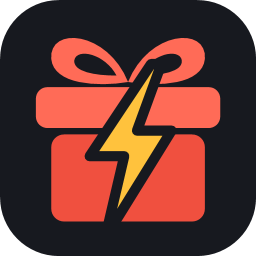
</p>

<h1 align="center">GiftDeck</h1>

<p align="center">
  <b>Turn TikTok LIVE gifts into actions.</b><br>
  A free, all-in-one Windows control room for TikTok (and Kick) streamers: unlimited gift events,
  one-click game mods for GTA V and Minecraft, one-button Go LIVE with OBS running in the background,
  overlays, alerts, a Gift Spinner, text to speech and music.
</p>

<p align="center">
  <a href="https://github.com/Obiwayne/GiftDeck/releases/latest"><b>⬇&nbsp; Download GiftDeck for Windows</b></a>
  &nbsp;·&nbsp; free &nbsp;·&nbsp; no accounts, no price plans, no limits
</p>

<p align="center">
  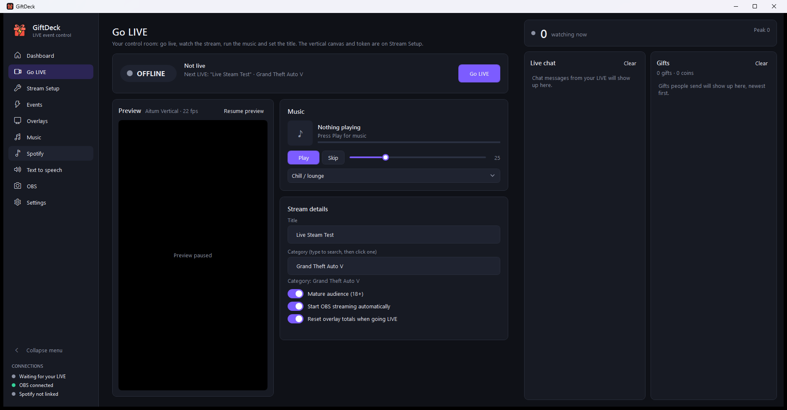
</p>

---

## Contents

- [What it does](#what-it-does)
- [Screenshots](#screenshots)
- [Download and install](#download-and-install)
- [What you need](#what-you-need)
- [First start: the setup screen](#first-start-the-setup-screen)
- [Going live](#going-live)
- [Games: one-click mods](#games-one-click-mods)
- [Events: triggers and actions](#events-triggers-and-actions)
- [Overlays, alerts and the Gift Spinner](#overlays-alerts-and-the-gift-spinner)
- [Text to speech](#text-to-speech)
- [Kick](#kick)
- [Profiles (one setup per game)](#profiles-one-setup-per-game)
- [Music](#music)
- [How it works](#how-it-works)
- [Your data and keys](#your-data-and-keys)
- [Troubleshooting](#troubleshooting)
- [Building from source](#building-from-source)
- [Project layout](#project-layout)
- [Disclaimer](#disclaimer)
- [Credits and licence](#credits-and-licence)

## What it does

**Gift events with no limit.** When a viewer sends a gift, follows, shares, likes, chats or subscribes,
GiftDeck runs the actions you set: trigger an effect in your game, press a keyboard shortcut, play a
sound, show an alert, spin the Gift Spinner, switch an OBS scene, speak text aloud, control Spotify, or
run a program. Add as many events as you like.

**58 games, set up for you.** The **Games** page is a library you can search and filter. **GTA V**
and **Minecraft** are set up in one click: GiftDeck finds the game, installs its mods, backs up every
file it replaces, and loads a ready-made set of events. GTA V gets 416 triggers (every Chaos Mod V
effect plus vehicles, weapons, money, teleports and more); Minecraft gets its own server on your PC with
50+ commands and three streamer-vs-viewers mini-games. **7 Days to Die**, **Project Zomboid**,
**Terraria** and **Left 4 Dead 2** take commands through your own game server's console. 52 more games
get a set-up guide and key-press ideas.

**One app, OBS in the background.** GiftDeck runs OBS for you, hidden, on a portrait 1080x1920 canvas
made from your vertical layout. Switch scenes, toggle layers and mix audio from GiftDeck; press
**Edit in OBS** when you want OBS's own window.

**One-button Go LIVE.** GiftDeck opens your TikTok LIVE through your Streamlabs login, gets the stream
key and starts OBS. Change the title or category mid-stream and it restarts the LIVE with the new
details in about 20 seconds.

**Overlays and alerts.** One **all-in-one overlay** link for TikTok LIVE Studio or OBS shows alerts,
the Gift Spinner, goals and the top gifters. Alert videos can be plain green-screen clips: GiftDeck
removes the green for you. Alerts can **interrupt**: other gifts wait until a jumpscare has played.

**Checks everything before you start.** Every launch opens on a setup screen that walks new users
through what's missing and waits until OBS and TikTok are connected. Closing GiftDeck shuts OBS down
cleanly and puts your own OBS setup back.

## Screenshots

| First start | Games |
|---|---|
| 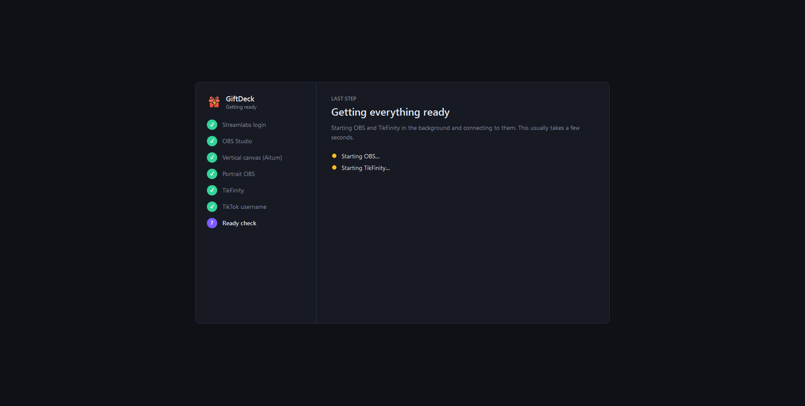 | 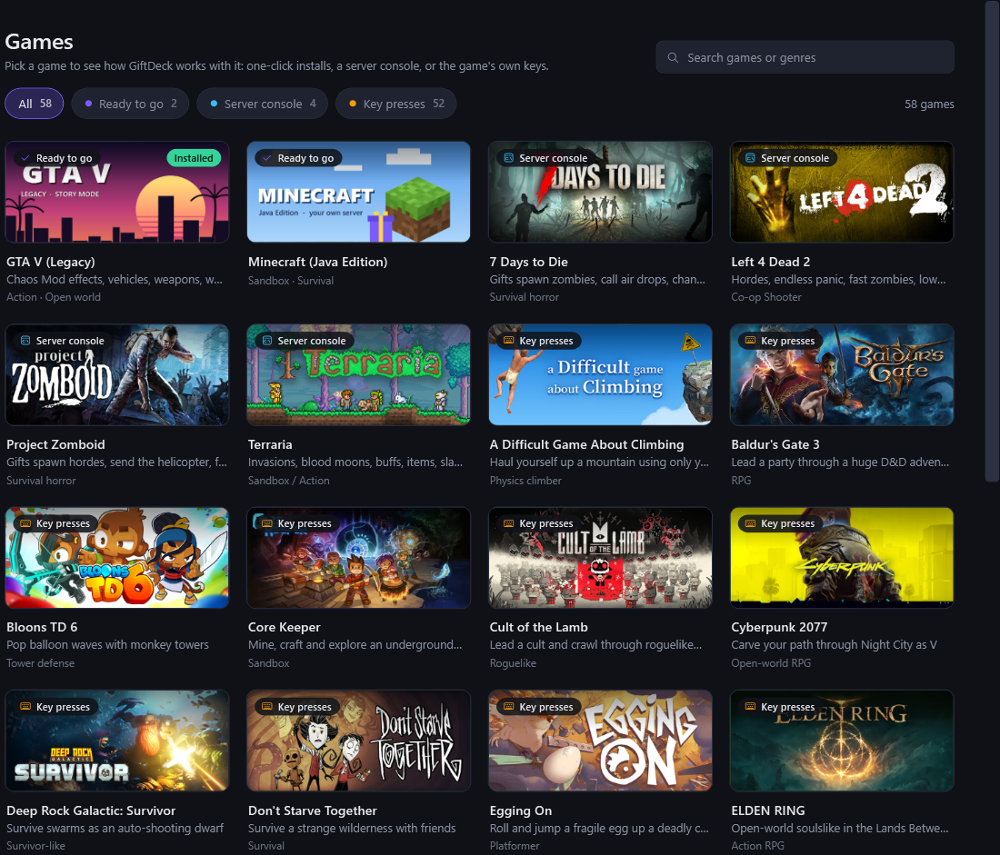 |
| **GTA V** | **Minecraft** |
| 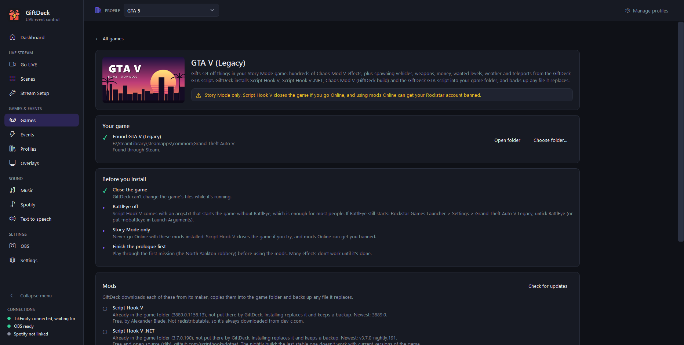 | 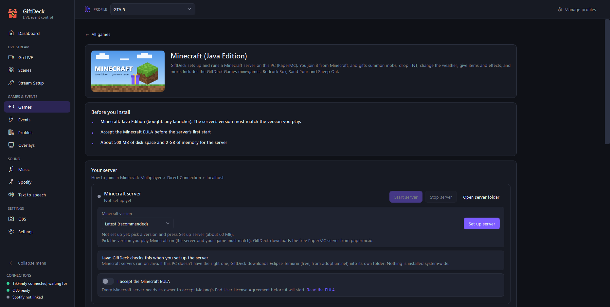 |
| **Server console game** | **Key-press game** |
| 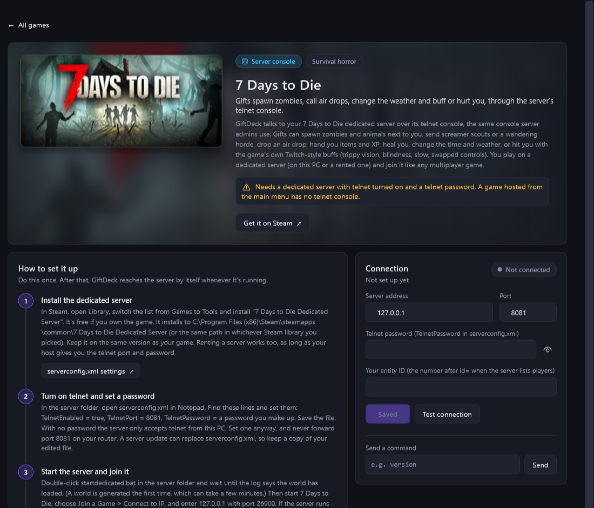 | 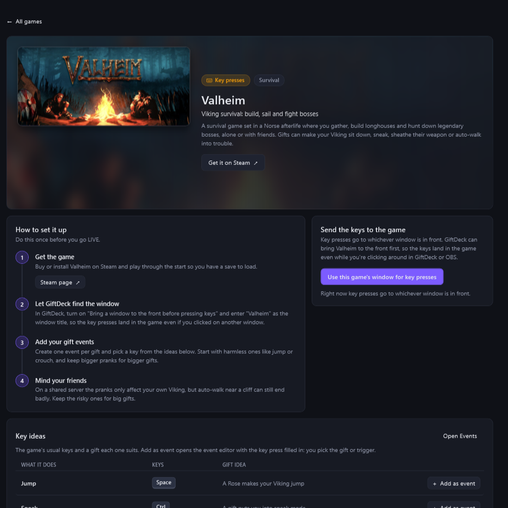 |
| **Events** | **Text to speech** |
| 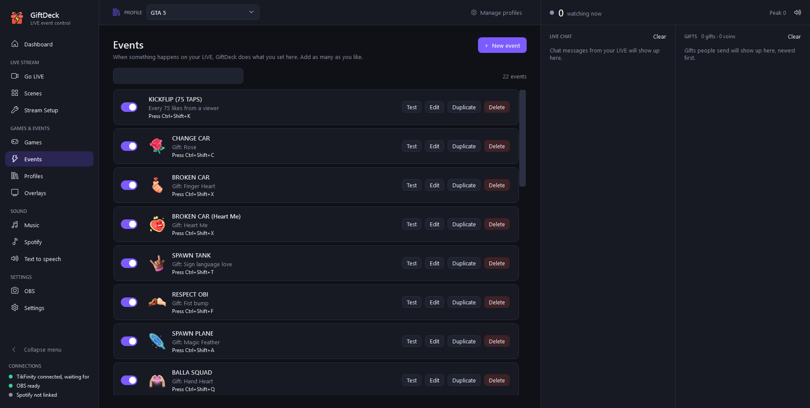 | 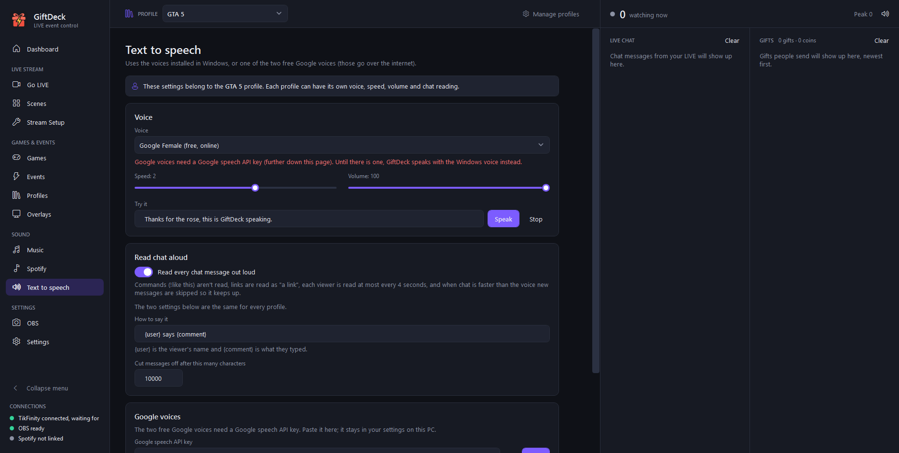 |
| **Scenes** | **Overlays** |
| 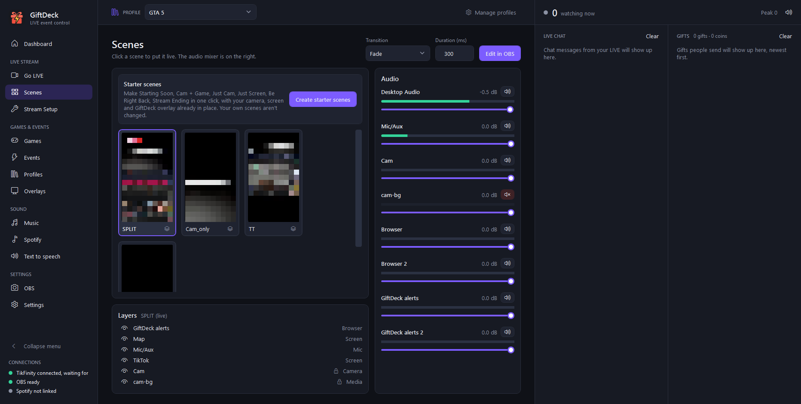 | 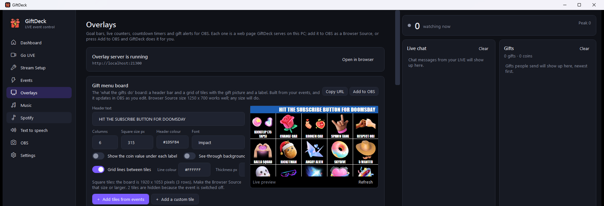 |

## Download and install

1. Go to **[Releases](https://github.com/Obiwayne/GiftDeck/releases/latest)** and download
   **`GiftDeck-Setup-x.y.z.exe`** (about 80 MB).
2. Double-click it and click through the installer. It installs just for you, so it doesn't ask for
   an administrator password.
3. Open **GiftDeck** from the Start menu or Desktop. The setup screen takes it from there.

Everything GiftDeck needs to run is inside the installer (including .NET and Node.js). Anything else
(OBS, Streamlabs, TikFinity, game mods, a Minecraft server, ffmpeg) is downloaded from its maker's own
site when you press the button for it, never bundled.

> **"Windows protected your PC"?** GiftDeck isn't code-signed (certificates cost money), so Windows
> SmartScreen may warn about a new download. Click **More info → Run anyway**. The installer is built
> from this repository's source by `build-installer.ps1`.

**Updating:** download the new installer and run it. Your settings, events and profiles are kept.
**Uninstalling:** *Windows Settings → Apps → GiftDeck → Uninstall*. Your settings stay in
`%APPDATA%\GiftDeck` in case you reinstall; delete that folder to remove them too.

## What you need

| | Needed for | Notes |
|---|---|---|
| **Windows 10/11 (64-bit)** | everything | |
| **[OBS Studio](https://obsproject.com)** 31+ | Go LIVE, scenes, preview | the setup screen downloads it for you |
| **[Aitum Stream Suite](https://aitum.tv)** (OBS plugin) | your vertical (portrait) layout | the setup screen downloads it; GiftDeck turns its vertical scenes into a portrait setup |
| **[Streamlabs Desktop](https://streamlabs.com)** login | the Go LIVE button | log in once with TikTok; GiftDeck picks up the login and you can close Streamlabs |
| **TikTok account with Streamlabs LIVE access** | the Go LIVE button | granted by TikTok; GiftDeck tells you whether yours has it |
| **[TikFinity](https://tikfinity.zerody.one)** | reading **18+** LIVEs | TikTok only sends 18+ chat and gifts to logged-in viewers; GiftDeck installs and runs TikFinity hidden |
| A game from the **Games** page | game events | GTA V (Legacy, Story Mode), Minecraft: Java Edition, a server console game or a key-press game |
| Free **[Jamendo](https://devportal.jamendo.com) Client ID** | Music page | optional |
| **Spotify** Premium + a free developer app | Spotify actions | optional |

## First start: the setup screen

GiftDeck opens on a setup screen that goes through, in order, only what's still missing:

1. **Streamlabs login.** Download and install Streamlabs Desktop (one button), log in with TikTok (the
   QR code is quickest). GiftDeck spots the login by itself and offers to close Streamlabs.
2. **OBS Studio** and 3. **Aitum Stream Suite**: download and install, one button each.
4. **Portrait OBS.** GiftDeck makes a "GiftDeck Portrait" copy of your vertical scenes (your own OBS
   setup isn't changed) and from then on runs OBS hidden on it. If your own OBS is open, it asks
   before closing it.
5. **TikFinity** (for 18+ LIVEs): install it, log in with the QR code, and switch off TikFinity's own
   Events (GiftDeck runs your events; otherwise gifts would fire twice).
6. **Your TikTok username**, filled in from your Streamlabs login.
7. **Ready check.** Waits until OBS and your LIVE reader are connected, then opens the app.

Every download and install has a **Cancel** button. A download that stalls for 30 seconds stops by
itself, and half-finished files are deleted, so you can just press the button again. You can also
cancel the Streamlabs login if you change your mind.

Someone who's already set up only sees the ready check for a few seconds. **Stream Setup** has the same
steps as a checklist, plus the choice of how GiftDeck reads your LIVE:

- **The GiftDeck bridge** (no login): fine for normal LIVEs, but TikTok sends no chat or gifts from 18+
  LIVEs to logged-out viewers.
- **TikFinity** (logged in): works with 18+ LIVEs. GiftDeck starts it hidden and closes it with GiftDeck.

## Going live

On **Go LIVE**, set the title and category, pick your scene, and press **Go LIVE**. GiftDeck checks OBS
is ready first, then opens the LIVE on TikTok, sends OBS the stream key, starts streaming, and shows
**✓ TikTok confirms you're live** once TikTok shows it (or a clear warning after 90 seconds). The
buttons wait while one step is running, so you can't start the same LIVE twice.

- **Scenes:** one button per scene (sizes S, M, L; a search box appears when you have lots), with the
  live scene in red. The **Scenes** page adds thumbnails, layers and an audio mixer.
- **No scenes yet?** On the **Scenes** page, **Create starter scenes** makes *Starting Soon*, *Cam + Game*,
  *Just Cam*, *Just Screen*, *Be Right Back* and *Stream Ending* in one click, with your webcam, your
  screen and the all-in-one overlay already placed. It only adds the ones you don't have.
- **Change the title or category while live:** TikTok can't edit a running LIVE, so GiftDeck offers
  **Restart LIVE with these details**: it ends the LIVE and opens a new one straight away. Viewers have
  to rejoin; GiftDeck's own totals keep counting.
- **TTS on/muted** next to the Go LIVE button, and the music player.
- **If sending stops:** when OBS stops streaming by itself, Go LIVE says *Not sending* and offers
  **Start sending again**. If GiftDeck's OBS closes mid-LIVE, GiftDeck starts it again and carries on
  sending to the same LIVE. The vertical relay to TikTok restarts itself too.
- **End LIVE** stops OBS and closes the LIVE. If TikTok doesn't answer, press it again. Closing GiftDeck
  while you're LIVE asks first. Closing it shows *Shutting down GiftDeck* until OBS has closed and your
  own OBS setup is back.

> **Mature audience (18+)** limits who can see your LIVE, and means GiftDeck has to read it through TikFinity.

## Games: one-click mods

Open **Games** to see a library of 58 games. Type in **Search games or genres**, or pick a filter:

- **Ready to go:** GTA V and Minecraft. One-click mods (or a server) and ready-made presets.
- **Server console:** 7 Days to Die, Project Zomboid, Terraria and Left 4 Dead 2. GiftDeck sends admin
  commands to your own game server.
- **Key presses:** 52 games. Gifts press the game's own keys.

Cover art comes from each game's Steam store image. It's downloaded once and kept on your PC.

For **Ready to go** games, click the game and press **Install**. GiftDeck finds the game, downloads each
mod from its maker, **backs up every file it replaces** and refuses to change anything while the game is
running. **Uninstall** puts the folder back exactly as it was. An **Installed** tag shows on games that are
set up (including mods you installed yourself). Nothing changes until you press Install or pick a preset.

### GTA V (Legacy, Story Mode only)

Installs Script Hook V, Script Hook V .NET, **Chaos Mod V (GiftDeck build)** and the **GiftDeck GTA script**:

- **416 triggers:** all 369 Chaos Mod effects (GiftDeck can start any of them, even ones switched off for
  random picks) plus 47 of GiftDeck's own: spawn any vehicle, weapons, money, wanted level, attackers,
  moto cops, animals, jail cage, ramps, teleports, skydive, drunk, earthquake and more.
- In game: a green *GiftDeck GTA ready* greeting, **F10** menu (connection, pause, test any command), and
  an on-screen note of who sent what.
- A ready-made **GTA V Gift Chaos** preset: 22 events from a Rose (kickflip) to a Lion (Doomsday).

> Never go Online with mods installed: Script Hook V closes the game if you try, and mods Online can get
> your Rockstar account banned. Finish the prologue mission first.

### Minecraft (Java Edition)

GiftDeck sets up and runs a **Minecraft server on your PC** (PaperMC, the right Java downloaded if
needed, the EULA accepted only by you). Join it at `localhost`; gifts summon mobs with the viewer's name,
drop TNT, strike lightning, change the weather, give items and effects.

**GiftDeck Games** mini-games (our free plugin, installed with the server):

| Game | You | Gifts that hurt | Gifts that help |
|---|---|---|---|
| **Bedrock Box** | dig down 30 layers inside a bedrock box | TNT, sand, anvils, mobs | better pickaxe, haste, drill, heal |
| **Sand Pour** | survive 3 minutes in a glass pit | sand, gravel, concrete, anvils | shovel, dig, haste, heal |
| **Sheep Out** | keep the meadow clear for 3 minutes | coloured and rainbow sheep | better sword, smite, heal |

Your items, position and health are saved when a game starts and given back after it. Each game has a
ready-made preset, and the server panel has start/stop buttons.

### Server console games

These games run on a dedicated server (on your PC or a rented one), and you join it like any
multiplayer game. GiftDeck sends admin commands to that server. Each game's page has:

- a **How to set it up** guide for the server,
- a connection card: server address, port, password and your player name, with **Test connection**,
- the list of **Commands** to use in an event with **Run a game command**.

| Game | How GiftDeck connects | Default port | Example commands |
|---|---|---|---|
| **7 Days to Die** | telnet console | 8081 | spawn zombies, screamer scouts, wandering horde, air drop |
| **Project Zomboid** | RCON | 27015 | spawn a horde, helicopter, gunshot, thunderstorm |
| **Terraria** | TShock's REST API | 7878 | invasions, Blood Moon, slime rain, boss summon items |
| **Left 4 Dead 2** | RCON | 27015 | horde, endless panic, fast zombies, low gravity |

- **Terraria** can't drop a single mob or boss on you. TShock only allows that for players in the game,
  not over its REST API, so its commands use invasions, events and items instead.
- **Left 4 Dead 2** is for your own server only. Most commands need `sv_cheats 1`, which turns off
  achievements.

### Key-press games

The other 52 games work by pressing keys while you play. Nothing is installed. Each game's page has a
**How to set it up** guide and a list of **Key ideas**: the game's default keys, each with **Add as event**.
Press **Use this game's window for key presses** so the keys go to the game.

- The ideas use each game's default keys. If you changed a key in the game, change it in the event too.
- Some games ignore key presses in exclusive fullscreen. Switch them to windowed or borderless.
- Games with anti-cheat are for single-player or offline play only (for example Elden Ring).
- **Palworld** is a key-press game: its server console can only broadcast messages (and its RCON is
  being retired), so there's nothing useful to connect to.

## Events: triggers and actions

**Triggers:** a specific gift (optionally a minimum coin total), any gift in a coin range, follow,
share, every N likes, any chat message or a chat command (e.g. `!boom`), subscribe, join. With Kick on,
each event can listen to TikTok, Kick, or both.

**Actions** (as many as you like, run in order):

| Action | Example |
|---|---|
| Run a game command | *Spawn vehicle: rhino* in GTA V, *Summon: zombie x5* in Minecraft (searchable list, with a Test button) |
| Press a key or shortcut | `Ctrl+Shift+C` into a game |
| Play a sound | an MP3 from disk, or search MyInstants from the built-in library |
| Show an alert | a picture, GIF or video alert, optionally interrupting everything else |
| Spin the Gift Spinner | a random event from a weighted pool |
| Switch OBS scene / show or hide a source | flash a source for a few seconds |
| Wait | pause between actions |
| Text to speech | "`{user}` sent `{gift}`!" |
| Spotify | queue a song request, skip, pause, set volume |
| Run a program | anything on your PC |

**Combos:** by default a combo (e.g. 15 Roses in a row) runs the event once when the combo ends. Per
event you can instead run the actions once per gift, with a cap. If TikTok never sends the end of a
combo, it still counts after 5 quiet seconds.

**The Events page:** type in the search box to filter by name, gift, trigger or action; the count shows
how many events you have. Double-click an event (or select it and press **Enter**) to edit it, and
press **Delete** to delete it. The editor asks before throwing away unsaved changes: **Esc** cancels and
**Ctrl+S** saves. Number boxes accept `1,000` as well as `1000`.

**Test** runs an event straight away. If it presses keys, it counts down 3 seconds first so you can
click into your game. Test events show their alerts but don't change goals, timers or top gifters.

## Overlays, alerts and the Gift Spinner

GiftDeck serves overlay pages at `http://localhost:21300`. Use **Copy URL** or **Add to OBS** (which
creates the Browser Source for you, sound included):

- **All-in-one overlay** (recommended): one link, added once to TikTok LIVE Studio (*Add source → Link*)
  or OBS, showing alerts, the Gift Spinner, goals, the top 3 gifters and optionally the gift board or gift
  list. Switch each part on or off and choose where it sits.
- **Alerts:** gift alerts, plus your own alerts with a picture, GIF or video, a sound and text with
  `{user}`, `{gift}`, `{count}`. Tick **Remove green background** and a normal green-screen MP4 plays
  see-through (no editing apps needed). **Interrupt** makes other gifts wait until it has played.
- **Gift Spinner:** a wheel that lands on one of your events. Give any event a chance on the wheel
  (Common, Uncommon, Rare, Epic, Legendary) right in the event editor.
- **Goal bars, counters, countdown timers** viewers extend with gifts, the **gift menu board**, a
  **gift list** and a **top 3 gifters** strip, all built from your events and live stats.

## Text to speech

Speak chat messages and event text with a Windows voice or one of two **Google voices (male and
female, online)**. The Google voices need a Google speech API key: paste it on the **Text to speech** page
(it stays in your settings on this PC). Each profile keeps its own voice, speed, volume and chat reading. The speaker button
on the right-hand panel and on Go LIVE **mutes** everything at once (it stays muted after a restart, and
the menu shows *Text to speech (muted)* so you don't forget).

**Reading chat** stays calm on a busy LIVE: commands (`!like this`) aren't read, links are read as
"a link", each viewer is read at most once every 4 seconds, and when chat is faster than the voice new
messages are skipped so it keeps up. If you pick a Google voice before adding the key, GiftDeck speaks
with the Windows voice instead (the page tells you).

## Kick

Switch Kick on in **Stream Setup** and type your channel name: Kick chat, subs, gifted subs and Kicks
gifts (1 Kick = 1 coin) run the same events as TikTok, even while you're live on both. No login or Kick
developer account is needed. Kick's public feed no longer says who followed, so follows only count when
your channel has a follower goal, and show as "Someone".

## Profiles (one setup per game)

Keep a separate setup for each game or show. The **PROFILE** dropdown at the top of every page switches
the events, overlays, LIVE title and category, and text-to-speech voice. On **Profiles** you can create,
duplicate, rename, delete, **Export** a profile as one `.giftdeck` file (with its sounds and pictures) and
**Import** someone else's. Switching while you're live asks first.

## Music

The **Music** page (and the player on **Go LIVE**) streams free Creative Commons tracks from Jamendo,
shuffled, one after another. Pick a style and keep *Instrumental only* on to talk over it. The music
turns down while text to speech is talking (**Turn the music down while text to speech is talking** on
the Music page, on by default).

**Spotify song requests** from chat have a per-viewer wait between requests (5 minutes by default, 0 for
no limit), and you can tick a box so songs Spotify marks as explicit aren't queued. Both are on the **Spotify**
page.

> Many Jamendo tracks are licensed for non-commercial use, and a gift-earning LIVE may not count as
> that. If TikTok ever mutes a moment, skip the track or change style.

## How it works

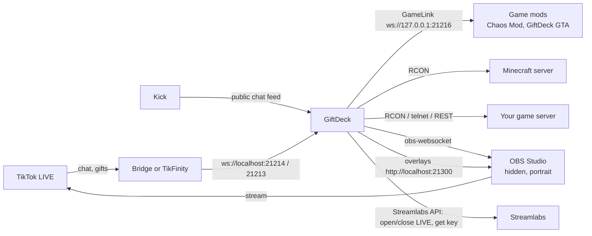

- **Reading your LIVE:** the bundled bridge ([TikTok-Live-Connector](https://github.com/zerodytrash/TikTok-Live-Connector))
  reads a public LIVE without logging in; for 18+ LIVEs GiftDeck listens to TikFinity's local feed instead.
- **GameLink:** game mods connect to GiftDeck on `ws://127.0.0.1:21216`, send their list of commands,
  and run the ones your events trigger. The protocol is in `docs/v2.1/plan.md`.
- **OBS engine:** GiftDeck starts OBS hidden on its portrait setup, restarts it if it's closed, and puts
  your own OBS scene collection and profile back when GiftDeck closes.
- **Go LIVE** uses the same Streamlabs API as Streamlabs Desktop to open and close the LIVE.

## Your data and keys

- Settings, events, tokens and keys live in `%APPDATA%\GiftDeck` on your PC and are never uploaded
  anywhere except to the service they belong to (Streamlabs, Spotify, Jamendo).
- In the app, tokens, stream keys, client IDs and passwords show as dots until you click the eye button.
- The files in `%APPDATA%\GiftDeck` are plain JSON. Anyone with access to your Windows account can read
  them, so don't share that folder.
- If a settings or events file can't be read (after a crash, say), GiftDeck keeps the old file aside,
  untouched, as `<name>.unreadable-<date>`, and tells you where. `log.txt` rolls over to `log.old.txt`
  at 5 MB.

## Troubleshooting

| Problem | Fix |
|---|---|
| No chat or gifts on an **18+** LIVE | Choose **TikFinity** under *Stream Setup → Reading your LIVE*, and log in to TikFinity. |
| Gifts fire twice | TikFinity's own Events are also on. Switch them off in TikFinity. |
| Sidebar says **OBS: error** | Hover it for the reason. GiftDeck restarts OBS if it's closed; *Stream Setup → OBS engine* shows more. |
| Closing OBS while editing | Fine: its X puts it back in the background. **Done editing** on Scenes does the same. |
| **⚠ TikTok isn't showing you as LIVE after 90 seconds** | Check the TikTok app. Make sure LIVE Studio isn't also live on the same account. |
| GTA: nothing happens | Games → GTA V should say **Connected in game**. Story Mode only, prologue finished, BattlEye off. |
| Minecraft: commands do nothing | Join the server first (`localhost`); most commands need a player online. |
| Console game says it can't reach the server | Check the server is running, its console is turned on (telnet, RCON or TShock's REST API), and the port and password match its config. A firewall isn't usually the problem when the server is on the same PC. |
| Keys don't reach the game | Press **Use this game's window for key presses** on the game's page. Play in windowed or borderless, not exclusive fullscreen. If you rebound a key in the game, change it in the event too. |
| Music: **"didn't accept that Client ID"** | Copy the Jamendo Client ID again, all of it. |
| Screen capture is black in *Just Screen* / *Cam + Game* | It only draws while the scene is live or previewed, so switch to it. On a laptop, open *Windows Settings → System → Display → Graphics*, add OBS and pick the graphics card your screen runs on. |
| **Some saved files couldn't be read** at start-up | The message lists where the old files were kept (in `%APPDATA%\GiftDeck`, ending `.unreadable-<date>`). Those settings or events started over empty; the kept copy is the file as it was. |

GiftDeck's own log is at `%APPDATA%\GiftDeck\log.txt`.

## Building from source

For developers. You need the [.NET 8 SDK](https://dotnet.microsoft.com/download/dotnet/8.0) and
[Node.js](https://nodejs.org).

```powershell
git clone https://github.com/Obiwayne/GiftDeck.git
cd GiftDeck
dotnet build -c Debug                      # bin\Debug\net8.0-windows\GiftDeck.exe

# The downloadable installer (also needs Inno Setup 6: winget install JRSoftware.InnoSetup)
powershell -ExecutionPolicy Bypass -File build-installer.ps1 -Version 2.1.0
#   -> build\GiftDeck-Setup-2.1.0.exe: self-contained GiftDeck + the bridge with its own Node.js
```

Game mods are separate projects:

- **GiftDeck GTA script** (`mods/gta5/GiftDeckGTA`, .NET Framework 4.8):
  `dotnet build mods/gta5/GiftDeckGTA -c Release -p:ShvdnDir="<folder with ScriptHookVDotNet3.dll>"`
  (a built copy ships in `Packs/gta5/files`).
- **GiftDeck Games** Minecraft plugin (`mods/minecraft/GiftDeckGames`, Java 17+): `gradlew build`
  (a built copy ships in `Packs/minecraft/plugins`).
- **Chaos Mod V (GiftDeck build)** lives in its own repository:
  [Obiwayne/ChaosModV-GiftDeck](https://github.com/Obiwayne/ChaosModV-GiftDeck) (GPL-3).

Test harnesses are under `tests/` and `tools/`. The only NuGet packages are `System.Speech` and
`Microsoft.Web.WebView2`.

## Project layout

```
GiftDeck/
├─ Services/        TikTok/Kick feeds, rules engine, OBS engine + obs-websocket, Go LIVE (Streamlabs),
│                   GameLink, game packs installer, Minecraft server + RCON, game server consoles, overlays, spinner, alerts, TTS
├─ Views/           the pages: Dashboard, Go LIVE, Scenes, Stream Setup, Games, Events, Profiles, Overlays, ...
├─ Overlays/        the HTML overlay pages served to OBS / TikTok LIVE Studio
├─ Packs/           game packs: catalog.json, pack.json, command lists, presets, bundled mods (gta5, minecraft)
├─ mods/            source of GiftDeck's own game mods (GTA script, Minecraft plugin)
├─ bridge/          bridge.js: reads your TikTok LIVE (Node)
├─ docs/            screenshots and design notes (docs/v2.1)
├─ tests/, tools/   test harnesses and developer tools
└─ build-installer.ps1 / installer.iss   the downloadable installer
```

## Disclaimer

GiftDeck is an independent project, **not affiliated with or endorsed by TikTok, ByteDance, Kick,
Streamlabs, OBS, Aitum, TikFinity, Rockstar Games, Take-Two, Mojang, Microsoft, Google, Jamendo or
Spotify**. Reading a LIVE, opening a LIVE through Streamlabs, the Google voices and Kick's chat feed
rely on unofficial interfaces that can change or stop working at any time. Game mods are for single-player
/ your own server only. Use it at your own risk and within each service's and game's terms.

## Credits and licence

- [TikTok-Live-Connector](https://github.com/zerodytrash/TikTok-Live-Connector) (MIT) and [ws](https://github.com/websockets/ws) (MIT)
- [Chaos Mod V](https://github.com/gta-chaos-mod/ChaosModV) (GPL-3); GiftDeck's build is at
  [Obiwayne/ChaosModV-GiftDeck](https://github.com/Obiwayne/ChaosModV-GiftDeck)
- [Script Hook V](http://www.dev-c.com/gtav/scripthookv/) by Alexander Blade (downloaded from dev-c.com, not redistributed)
  and [Script Hook V .NET](https://github.com/scripthookvdotnet/scripthookvdotnet)
- [PaperMC](https://papermc.io) and [Eclipse Temurin](https://adoptium.net), downloaded on request
- [obs-websocket](https://github.com/obsproject/obs-websocket) and [Aitum Stream Suite](https://aitum.tv)
- [Node.js](https://nodejs.org) (MIT), bundled in the installer to run the bridge
- [ffmpeg](https://ffmpeg.org), downloaded on request from [gyan.dev](https://www.gyan.dev/ffmpeg/builds/) (not bundled)
- Music from [Jamendo](https://www.jamendo.com) (each track's own Creative Commons licence applies)

GiftDeck, the GiftDeck GTA script and the GiftDeck Games plugin are released under the [MIT licence](LICENSE).
