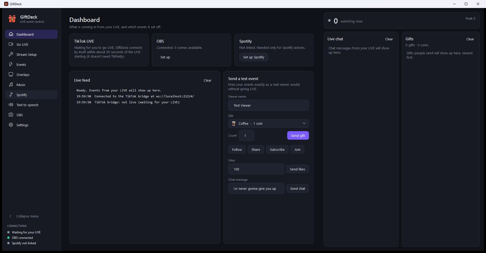
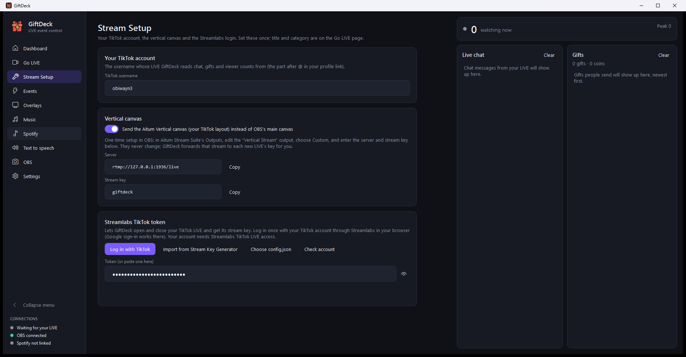
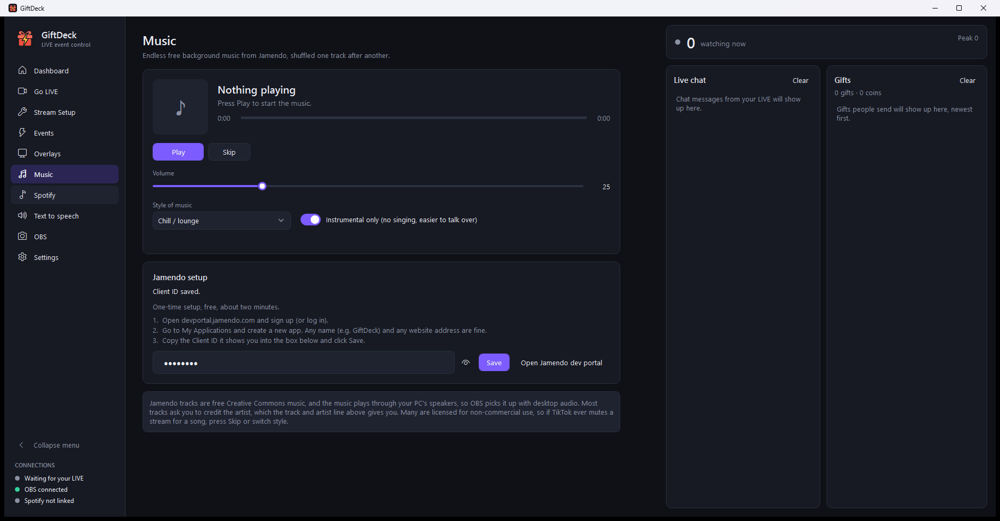
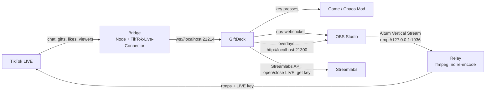

<p align="center">
  
</p>

<h1 align="center">GiftDeck</h1>

<p align="center">
  <b>Turn TikTok LIVE gifts into actions.</b><br>
  A free Windows control room for TikTok streamers: unlimited gift events, live chat and gift feed,
  viewer count, one-button Go LIVE with OBS, OBS overlays, background music and more.
</p>

<p align="center">
  <a href="https://github.com/Obiwayne/GiftDeck/releases/latest"><b>⬇&nbsp; Download GiftDeck for Windows</b></a>
  &nbsp;·&nbsp; free &nbsp;·&nbsp; nothing else to install
</p>

<p align="center">
  
</p>

---

## Contents

- [What it does](#what-it-does)
- [Screenshots](#screenshots)
- [Download and install](#download-and-install)
- [What you need](#what-you-need)
- [First-time setup](#first-time-setup)
- [Going live](#going-live)
- [Profiles (one setup per game)](#profiles-one-setup-per-game)
- [Events: triggers and actions](#events-triggers-and-actions)
- [Overlays for OBS](#overlays-for-obs)
- [Music](#music)
- [How it works](#how-it-works)
- [Your data and keys](#your-data-and-keys)
- [Troubleshooting](#troubleshooting)
- [Building from source](#building-from-source)
- [Project layout](#project-layout)
- [Disclaimer](#disclaimer)
- [Credits and licence](#credits-and-licence)

## What it does

**Gift events with no limit.** When a viewer sends a gift, follows, shares, likes, chats or subscribes,
GiftDeck runs the actions you set: press a keyboard shortcut (for example a Chaos Mod effect in GTA V),
play a sound, switch an OBS scene, show or hide a source, speak text aloud, control Spotify or music,
or run a program. Add as many events as you like.

**A control room for going live.** One page with a red **● LIVE** light and timer, confirmation straight
from TikTok that you really are live, a live preview of what OBS is sending, the stream title and
category, and the music player. Chat, gifts and the viewer count sit alongside on every page.

**One-button Go LIVE.** GiftDeck opens your TikTok LIVE through Streamlabs, gets the stream key, and
starts OBS streaming your vertical canvas (via Aitum Stream Suite) or your main canvas. End LIVE closes
it all again.

**Reads your LIVE directly.** Chat, gifts, likes, follows and viewer counts come straight from TikTok
through a small bundled bridge. No TikFinity login is required (TikFinity's feed still works if you
prefer it).

**Overlays for OBS.** Goal bars, live counters, countdown timers viewers can extend with gifts, gift
alerts, and a "what the gifts do" menu board built from your events.

**Endless background music.** Free Creative Commons tracks from Jamendo, shuffled, with play/pause,
skip, volume and style controls on the Go LIVE page.

**Profiles.** One setup per game (events, overlays, title), switched from a dropdown at the top of
every page, and shareable as a single file.

**Keeps your keys hidden.** Tokens, stream keys, client IDs and passwords show as dots until you click
the eye button.

## Screenshots

| Dashboard | Events |
|---|---|
|  |  |
| **Stream Setup** | **Music** |
|  |  |


## Download and install

1. Go to **[Releases](https://github.com/Obiwayne/GiftDeck/releases/latest)** and download
   **`GiftDeck-Setup-x.y.z.exe`** (about 80 MB).
2. Double-click it and click through the installer. It installs just for you, so it doesn't ask for
   an administrator password.
3. Open **GiftDeck** from the Start menu or Desktop, then follow [First-time setup](#first-time-setup).

Everything GiftDeck needs to run is inside the installer (including .NET and Node.js for the TikTok
connection). The only extra, **ffmpeg** (for Go LIVE with a vertical canvas), is one click inside the
app: *Stream Setup → Download ffmpeg*.

> **"Windows protected your PC"?** GiftDeck isn't code-signed (certificates cost money), so Windows
> SmartScreen may warn about a new download. Click **More info → Run anyway**. The installer is built
> from this repository's source by `build-installer.ps1`.

**Updating:** download the new installer and run it. Your settings and events are kept.
**Uninstalling:** *Windows Settings → Apps → GiftDeck → Uninstall*. Your settings stay in
`%APPDATA%\GiftDeck` in case you reinstall; delete that folder to remove them too.

## What you need

| | Needed for | Notes |
|---|---|---|
| **Windows 10/11 (64-bit)** | everything | everything else GiftDeck needs is in the installer |
| **[OBS Studio](https://obsproject.com) 30+** | Go LIVE, preview, scene actions | turn on *Tools → WebSocket Server Settings → Enable* |
| **[Aitum Stream Suite](https://aitum.tv)** (OBS plugin) | Go LIVE with a vertical canvas | optional; without it GiftDeck streams OBS's main canvas |
| **ffmpeg** | Go LIVE with the vertical canvas | one click in GiftDeck: *Stream Setup → Download ffmpeg* |
| **TikTok account with Streamlabs LIVE access** | Go LIVE button | see below |
| Free **[Jamendo](https://devportal.jamendo.com) Client ID** | Music page | optional |
| **Spotify** Premium + a free developer app | Spotify actions | optional |

### Do I need Streamlabs or the Stream Key Generator?

**No.** GiftDeck logs in to Streamlabs itself: on **Stream Setup**, click **Log in with TikTok**, finish
the login in your normal browser (Google sign-in works there), and GiftDeck saves the token. You don't
need Streamlabs Desktop or the Stream Key Generator installed. (If you already use the generator,
**Import from Stream Key Generator** reads its token instead.)

What you *do* need is a TikTok account that has **LIVE access through Streamlabs**. That's granted to
your account by TikTok/Streamlabs; no app can get round it. **Check account** on Stream Setup tells you
whether yours has it.

## First-time setup

Everything below is on GiftDeck's own pages. Each takes a minute or two and you only do it once.

### 1. Your TikTok username — *Stream Setup*
GiftDeck needs to know whose LIVE to read. Until it does, the sidebar says **Set your TikTok username**.
Logging in with TikTok (step 2) fills it in for you; otherwise type your username (the part after `@`).
GiftDeck then reads that account's LIVE automatically whenever it's live: chat, gifts, likes, follows
and the viewer count. Reading a LIVE only uses public information, so no login is needed for this part;
if the username isn't the account you're logged in with, Stream Setup points that out.

### 2. Streamlabs login — *Stream Setup* (for the Go LIVE button)
Click **Log in with TikTok**, finish in the browser, then **Check account** to confirm LIVE access.

### 3. OBS — *OBS page*
In OBS: **Tools → WebSocket Server Settings → Enable WebSocket server**. GiftDeck reads the port and
password from OBS's settings on the same PC and connects by itself.

### 4. Vertical canvas (optional) — *Stream Setup*
If you stream a vertical layout with **Aitum Stream Suite**, set up its output once:

1. In OBS, open Aitum's **Outputs** and edit **Vertical Stream**.
2. Choose **Custom**.
3. Server: `rtmp://127.0.0.1:1936/live` — Stream key: `giftdeck`
4. Save.

These never change. At each Go LIVE, GiftDeck forwards that stream to the new LIVE's key (see
[How it works](#how-it-works)). If Aitum isn't set up, Go LIVE tells you before opening anything on TikTok.

### 5. Events — *Events page*
Click **+ New event**, choose a trigger (e.g. *Gift: Rose*), add actions (e.g. *Press Ctrl+Shift+C*),
save. **Test** fires it without going live.

### 6. Music (optional) — *Music page*
Create a free app at [devportal.jamendo.com](https://devportal.jamendo.com) (any name and website),
paste its **Client ID**, click **Save**, press **Play**.

### 7. Spotify (optional) — *Spotify page*
Create an app at [developer.spotify.com/dashboard](https://developer.spotify.com/dashboard) with the
redirect URI `http://127.0.0.1:8890/callback`, paste the Client ID, click **Link Spotify**. Spotify
Premium is needed to control playback.

## Going live

On **Go LIVE**, set the title and category, then press **Go LIVE**. GiftDeck:

1. opens the LIVE on TikTok through Streamlabs and gets its server and stream key,
2. starts the relay and Aitum's **Vertical Stream** output (or OBS's main stream),
3. asks TikTok every few seconds whether you're really live, and shows
   **✓ TikTok confirms you're live** — or a clear warning if it isn't after 90 seconds.

The **● LIVE** light and timer also work when you go live some other way (e.g. TikTok LIVE Studio),
because they follow what TikTok reports. **End LIVE** stops OBS, the relay, and closes the LIVE.

> **Mature audience (18+)** limits who can see your LIVE. Leave it off unless you mean it.

## Profiles (one setup per game)

Keep a separate setup for each game or show, e.g. **GTA 5** and **Roblox**. The **PROFILE** dropdown at
the top of every page shows which one you're using; pick another and GiftDeck loads that profile's:

- **events** (what each gift, follow, like or chat command does)
- **overlays** (the gift menu board and its pictures, goals, counters, countdowns)
- **LIVE title and category**

Your accounts, keys, OBS, music and sound library are shared by every profile. Switching while you're
live asks first, because gifts start doing what the new profile says straight away.

On the **Profiles** page you can create a blank profile, duplicate one to start a new game from it,
rename, delete, and **Export** a profile as one `.giftdeck` file, including the sound files and board
pictures it uses, to back it up or share it. **Import** adds someone's `.giftdeck` file as a new profile
(check the key presses match your game's shortcuts).

## Events: triggers and actions

**Triggers:** a specific gift (optionally a minimum coin total), any gift in a coin range, follow,
share, every N likes, any chat message or a chat command (e.g. `!boom`), subscribe, join.

**Actions** (as many as you like, run in order):

| Action | Example |
|---|---|
| Press a key or shortcut | `Ctrl+Shift+C` into GTA V's Chaos Mod |
| Play a sound | an MP3 from disk, or search MyInstants from the built-in library |
| Switch OBS scene / canvas scene | switch the Aitum Vertical canvas to *CAM* |
| Show or hide an OBS source | flash a source for a few seconds |
| Wait | pause between actions |
| Text to speech | "`{user}` sent `{gift}`!" |
| Spotify | queue a song request, skip, pause, set volume |
| Run a program | anything on your PC |

**Combos:** by default a combo (e.g. 15 Roses in a row) runs the event once when the combo ends. Per
event you can instead run the actions once per gift, with a cap.

## Overlays for OBS

GiftDeck serves overlay pages at `http://localhost:21300`. On the **Overlays** page, use **Copy URL**
or **Add to OBS** (which creates the Browser Source for you):

- **Goal bar** — progress towards a coin/likes/follows goal
- **Counters** — followers, likes, shares, coins, gifts, watching now
- **Countdown** — a timer viewers extend with gifts, follows, shares and likes
- **Alerts** — gift alerts with the gift picture
- **Gift menu board** — the "what each gift does" grid, built from your events

## Music

The **Music** page (and the player on **Go LIVE**) streams free Creative Commons tracks from Jamendo,
shuffled, one after another. Pick a style (chill, lo-fi, electronic, hip hop, rock, ...) and keep
*Instrumental only* on to talk over it. Music plays through your PC's speakers, so OBS picks it up with
desktop audio.

> Many Jamendo tracks are licensed for non-commercial use, and a gift-earning LIVE may not count as
> that. If TikTok ever mutes a moment, skip the track or change style.

## How it works



- **Bridge (`bridge/bridge.js`).** Uses [TikTok-Live-Connector](https://github.com/zerodytrash/TikTok-Live-Connector)
  to read a public LIVE without logging in, and re-sends each event on `ws://localhost:21214` in the
  same format TikFinity uses. GiftDeck starts it, restarts it if it stops, and it only connects when
  TikTok says you're live (it checks every 30 seconds) to stay within the free signing service's limits.
- **Relay.** Aitum's remote controls can start and stop an output but can't change its stream key, and
  TikTok gives a new key for every LIVE. So Aitum always sends to a fixed local address, and GiftDeck
  starts `ffmpeg -c copy` to forward that stream to each LIVE's key. The video isn't re-encoded.
- **Go LIVE** uses the same Streamlabs API as Streamlabs Desktop to open and close the LIVE.
- **Preview.** Snapshots of the scene OBS is sending (about 20 per second), only while the Go LIVE page
  is on screen.

**Performance** (measured on a 16-core PC while streaming-ready): GiftDeck ~0.4% CPU and ~190 MB RAM
with the preview on, the bridge ~0% and ~65 MB, OBS about +1% for the preview.

## Your data and keys

- Nothing personal is stored in this folder. Settings, events, tokens and keys live in
  `%APPDATA%\GiftDeck` on your PC and are never uploaded anywhere except to the service they belong to
  (Streamlabs, Spotify, Jamendo).
- In the app, tokens, stream keys, client IDs and passwords show as dots until you click the eye button.
- The files in `%APPDATA%\GiftDeck` are plain JSON. Anyone with access to your Windows account can read
  them, so don't share that folder.
- The bridge's debug dump (`raw.log`, which contains viewers' chat) is off unless you set
  `GIFTDECK_BRIDGE_DEBUG=1`.

## Troubleshooting

| Problem | Fix |
|---|---|
| Sidebar says **Waiting for your LIVE** while you're live | It connects within ~30 s of the LIVE starting. Check the username on Stream Setup. |
| No chat or gifts at all | Check the username on Stream Setup. Reinstalling repairs the bridge. Its log is `bridge\bridge.log` in GiftDeck's install folder. |
| Bridge log says **rate limit** | The free signing service's limit; it waits and retries. A free [Euler Stream](https://www.eulerstream.com) API key raises it. |
| Go LIVE: **"Vertical Stream output isn't set up"** | Do step 4 of setup (Aitum output → Custom, `rtmp://127.0.0.1:1936/live`, key `giftdeck`). |
| **⚠ TikTok isn't showing you as LIVE after 90 seconds** | Check the TikTok app. Make sure LIVE Studio isn't also live on the same account. |
| How fast do gifts arrive? | The Dashboard feed shows each gift's and chat message's delay from TikTok, e.g. `· 0.8 s`. Combo gifts (Rose etc.) also wait ~2–3 s for the combo to finish so a combo counts once; turn that off in Settings if you'd rather fire on every tap. |
| Keys fire twice | TikFinity's own events are also on. Turn them off in TikFinity (Actions & Events). |
| OBS not connected | Enable OBS's WebSocket server (Tools → WebSocket Server Settings). |
| Music: **"didn't accept that Client ID"** | Copy the Jamendo Client ID again, all of it. |

GiftDeck's own log is at `%APPDATA%\GiftDeck\log.txt`.

## Building from source

For developers. You need the [.NET 8 SDK](https://dotnet.microsoft.com/download/dotnet/8.0) and
[Node.js](https://nodejs.org).

```powershell
git clone https://github.com/Obiwayne/GiftDeck.git
cd GiftDeck

# Run it from source (uses your installed Node.js for the bridge)
powershell -ExecutionPolicy Bypass -File install.ps1      # builds dist\GiftDeck.exe, installs bridge packages, adds shortcuts

# Build the downloadable installer (also needs Inno Setup 6: winget install JRSoftware.InnoSetup)
powershell -ExecutionPolicy Bypass -File build-installer.ps1 -Version 1.0.0
#   -> build\GiftDeck-Setup-1.0.0.exe: self-contained GiftDeck + the bridge with its own Node.js
```

The only NuGet packages are `System.Speech` and `Microsoft.Web.WebView2`.

## Project layout

```
GiftDeck/
├─ Services/        TikTok feed, bridge + relay control, rules engine, key sender, OBS (obs-websocket v5 + Aitum),
│                   Streamlabs (Go LIVE + login), Spotify (PKCE), music (Jamendo), TTS, overlays server, storage
├─ Views/           Dashboard, Go LIVE, Stream Setup, Events + editors, Overlays, Music, Spotify, TTS, OBS, Settings
├─ Overlays/        the HTML overlay pages served to OBS
├─ bridge/          bridge.js — reads your TikTok LIVE (Node)
├─ Assets/          app icon
├─ Theme.xaml       dark theme and the logo artwork
├─ install.ps1      build + run from source
└─ build-installer.ps1 / installer.iss   the downloadable installer
```

## Disclaimer

GiftDeck is an independent project, **not affiliated with or endorsed by TikTok, ByteDance, Streamlabs,
OBS, Aitum, TikFinity, Jamendo or Spotify**. Reading a LIVE and opening a LIVE through Streamlabs rely
on unofficial, reverse-engineered interfaces that can change or stop working at any time. Use it at
your own risk and within each service's terms.

## Credits and licence

- [TikTok-Live-Connector](https://github.com/zerodytrash/TikTok-Live-Connector) (MIT) for reading LIVE events
- [ws](https://github.com/websockets/ws) (MIT)
- [obs-websocket](https://github.com/obsproject/obs-websocket) and [Aitum Stream Suite](https://aitum.tv)'s vendor requests
- [Node.js](https://nodejs.org) (MIT), bundled in the installer to run the bridge
- [ffmpeg](https://ffmpeg.org) for the relay, downloaded on request from [gyan.dev](https://www.gyan.dev/ffmpeg/builds/) (not bundled)
- The Streamlabs TikTok login and Go LIVE calls follow the same public web API as Streamlabs Desktop;
  GiftDeck's implementation is its own code.
- Music from [Jamendo](https://www.jamendo.com) (each track's own Creative Commons licence applies)

GiftDeck is released under the [MIT licence](LICENSE).
